# 仿慕课在线网络学习平台

## 1. 项目说明

+ 项目简介：本项目是以LAMP（Linux+Apache+MySQL+PHP）架构模式开发的在线网络学习平台，这里只有后端代码，前端部分由另一位同学实现，但是他找不到代码了^_^。因此网页看起来比较简陋，使用的都是html最基础的表单，但网站的功能还是非常完善的。

+ 功能模块：主要分为学生、教师、管理员三个角色。
    + 学生端：可以进行注册、修改个人信息、查课、选课、签到、回答作业、生成错题集、笔记共享等操作。
    + 教师端：可以进行注册、修改个人信息、创建并发布课程、上传课件、发布签到、创建并发布作业等操作。
    + 管理员：可以对学生用户和教师用户的个人信息进行维护管理。

## 2. 项目部署

这里只介绍本地部署方式，如果要正式上线，需要申请公网IP并绑定域名，可以通过云服务器实现。

+ LAMP环境搭建

```shell
# Ubuntu 22.04.3 LTS
# 安装Apache并启动
sudo apt-get install apache2
sudo service apache2 restart

# 安装MySQL并启动
sudo apt-get install mysql-server mysql-client
sudo service mysql restart

# 安装PHP及其扩展
sudo apt-get install php php-mysql libapache2-mod-php

# 将php.ini中的short_open_tag由Off设置为On，并重启Apache服务
cd /etc/php/8.1/apache2
sudo vim php.ini
sudo service apache2 restart
```

+ 项目运行

```shell
# 下载项目源码
git clone https://github.com/lijiang99/OnlineLearning.git OnlineLearning

# 导入SQL文件，建立项目所需的数据库
cd OnlineLearning/SQL
mysql -u root -p
source mydb.sql

# 修改源码conn.inc.php中的内容（数据库用户root及密码password）
# $pdo = new PDO('mysql:dbname=mydb;host=localhost', 'root', 'password');

# 将src中的源码移至网站根目录（/var/www/html），并删除默认的网站首页
sudo mv OnlineLearning/src/* /var/www/html/
sudo rm -rf index.html

# 在浏览器输入localhost或者127.0.0.1即可进入网站首页
```

## 3. 部分功能测试

+ 开启Session
```php
<?
echo phpinfo(); // 利用phpinfo查看Session的保存路径（session.save_path），并赋予其读写权限
?>
```
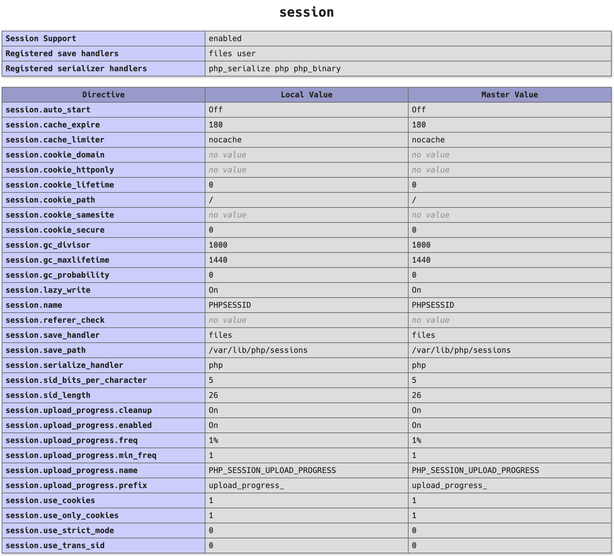

+ 学生用户注册/登录
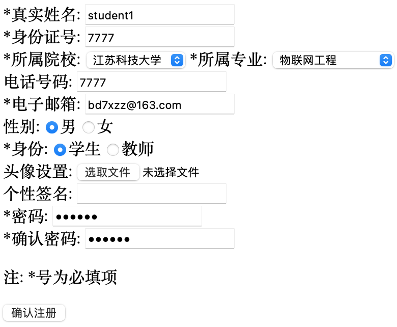


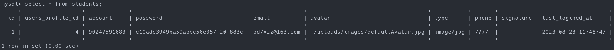

+ 学生选课
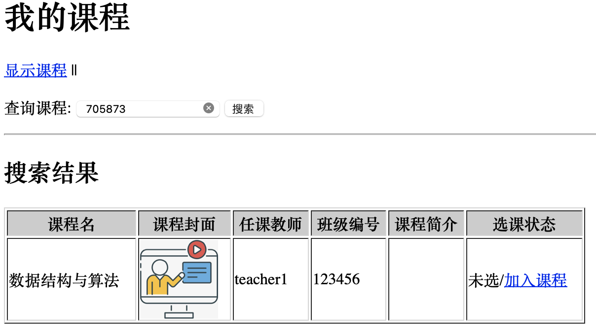
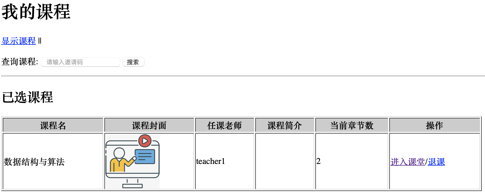

+ 学生完成作业
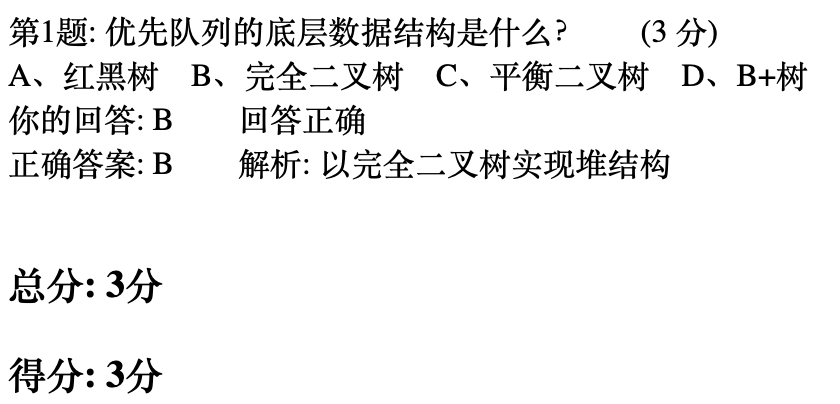

+ 教师管理课程
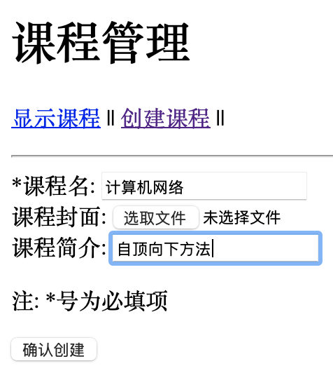
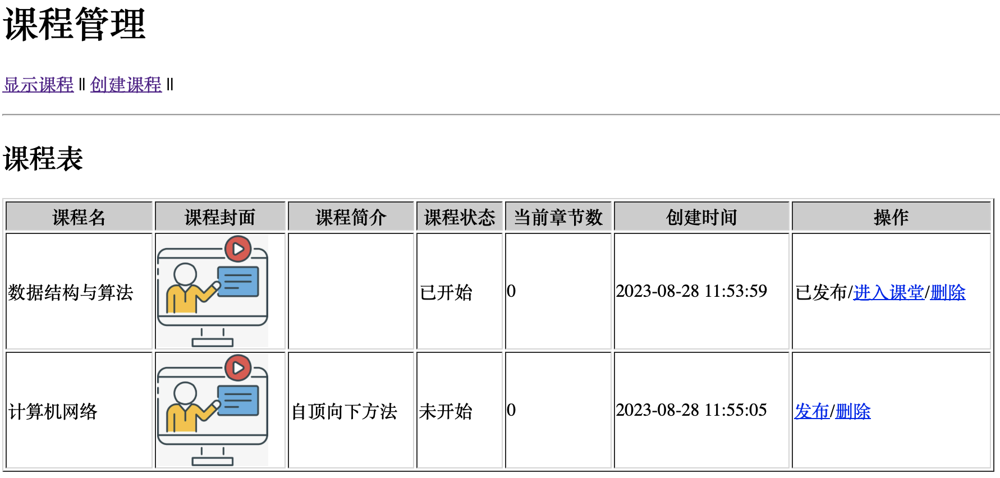
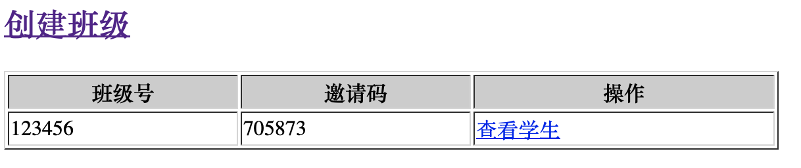

+ 教师发布作业
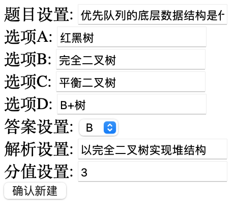
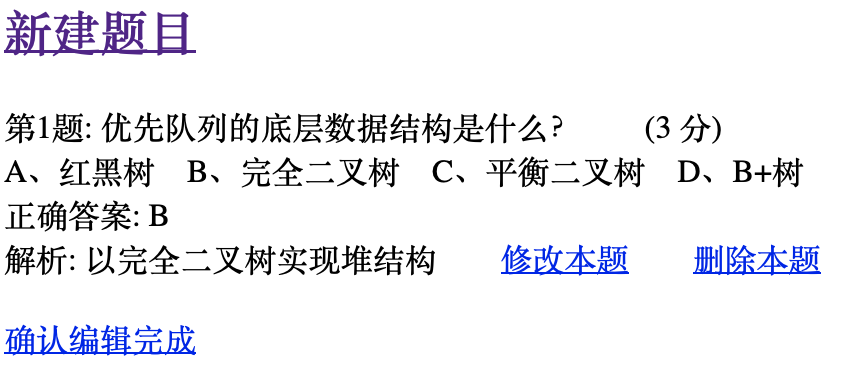
